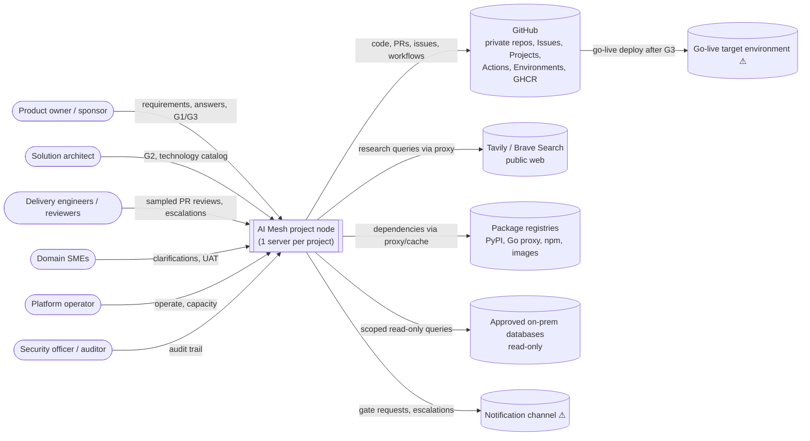
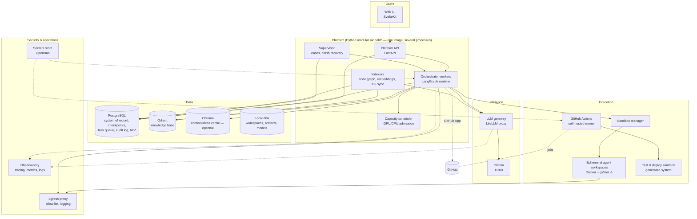
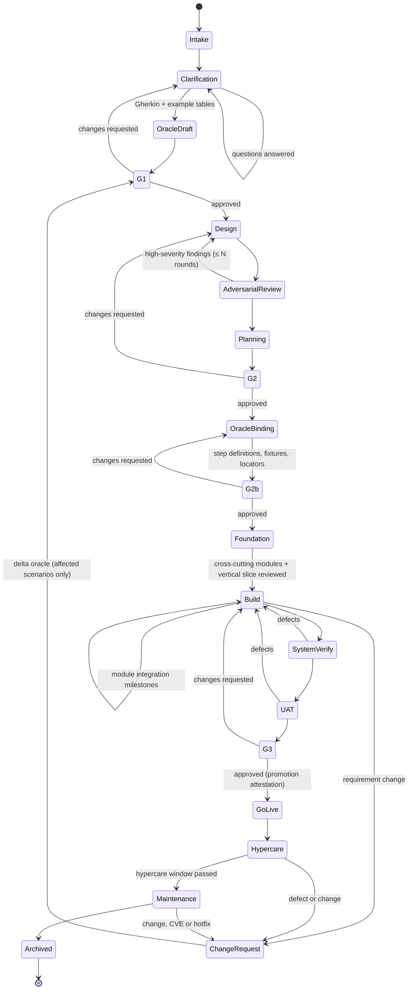
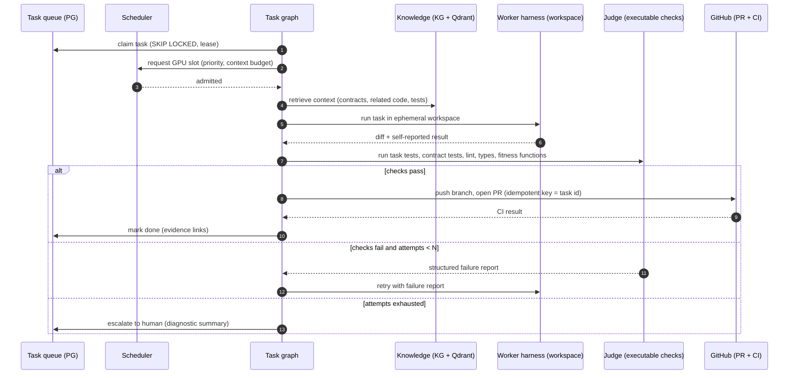

# 05 — Reference Architecture (Conceptual)

| | |
|---|---|
| **Project** | AI Mesh (working name) |
| **Status** | Draft v1.2 — revised after adversarial review R1 ([07](07-adversarial-architecture-review.md)); see §17; items marked ⚠ need confirmation |
| **Date** | 2026-10-05 |
| **Depends on** | [01-project-charter.md](01-project-charter.md), [02-constraints-and-infrastructure.md](02-constraints-and-infrastructure.md), [03-platform-requirements.md](03-platform-requirements.md), [04-technology-review-proposed-stack.md](04-technology-review-proposed-stack.md) |

## 1. Purpose and scope

This document describes the conceptual architecture of the **AI Mesh platform**: its building blocks, how they interact, where data lives, and how the platform is deployed on the customer's hardware. It is the basis for the ADRs listed in §15 and for Phase 0–1 work.

It does **not** prescribe the architecture of the software the platform *builds*. That is chosen per project by the architect agents, from the technology catalog, and approved at G2.

## 2. Architectural drivers

### 2.1 Confirmed decisions (2026-10-05)

| Driver | Source |
|---|---|
| All inference on-prem: Ollama + open-weights coding models on 1× H100 (80 GB) | C1–C3 |
| Server: AMD EPYC 9124 (16 cores / 32 threads, 1 NUMA node, AVX-512), 124 GB RAM, 4 TB disk, Ubuntu 24.04 | C3 |
| **One server per project** in v1; scale by adding servers | D12 |
| The stated stack applies to **the platform itself**: Python, Go, LangChain/LangGraph, Qdrant, Chroma, FastAPI, SQLAlchemy, Svelte web UI (Tauri optional) | C12, D4, D15 |
| Knowledge graph for project knowledge and entity interactions; Qdrant as knowledge base; Chroma as optional context/ideas cache | D10 |
| Private repositories on github.com; self-hosted Actions runners | D5 |
| Internet access via an allow-listed proxy; Tavily and Brave Search; read-only access to some on-prem databases | D11 |
| Generated systems are greenfield, 100k–250k LOC, microservices or modular monolith | C8, C11 |
| **"Production" means go-live** of the generated system; G3 is the go-live gate | FR-DEP-02 |
| Generated systems use **Python / FastAPI** with a **SvelteKit** front end, SQL-engine agnostic with **PostgreSQL** in v1; they go live in **clients' data centres and at client sites**, on **Docker Compose and Kubernetes**; the pilot client is reached directly | D8, D18–D21, [06](06-generated-system-baseline-and-release.md) |

### 2.2 Quality attributes that shape the design

1. **Verification first.** No implementation task starts without an executable oracle, and every "done" is decided by executable checks, not by an agent's claim.
2. **Fail closed.** Gates, judges and policy checks treat silence, errors and unparseable output as "not approved".
3. **Durability.** A crash or restart never loses verified work; long human waits cost nothing.
4. **Capacity awareness.** GPU time is the bottleneck, with CPU and RAM close behind. Every LLM call and every CI job is admitted by a scheduler.
5. **Least privilege and containment.** Untrusted content (web pages, documents, generated code) never grants permissions.
6. **Traceability.** Every artifact links back to requirements and forward to tests, code, decisions and releases.
7. **Replaceability.** Models, inference engines, worker harnesses and the graph engine sit behind interfaces.

## 3. Architectural style

- **The platform is a modular monolith in Python** (NFR-MNT-01): one codebase and one deployable application, with strictly enforced module boundaries (import-linter in CI). It runs as several processes from the same image: API, orchestrator workers, scheduler, indexers. Go is used only if a component proves it needs it (e.g. the sandbox manager).
- **Infrastructure services run as Docker containers** on the same host: Ollama, LLM gateway, PostgreSQL, Qdrant, optional Chroma, observability, egress proxy, secrets store, CI runner.
- **Single-tenant node.** Each server is a self-contained **project node** that runs the whole platform for exactly one project. There is no shared control plane in v1. A portfolio view across nodes is a Phase 4 concern (§13.2).
- **Git is the source of truth** for everything the project produces. Platform databases hold workflow state, telemetry and derived indexes.

## 4. System context (C4 level 1)



## 5. Containers on a project node (C4 level 2)



\* The knowledge-graph engine is PostgreSQL + Apache AGE or Neo4j (D10, Phase 1). If Neo4j is chosen, it is one more container.

| Container | Responsibility | Technology |
|---|---|---|
| Web UI | Gate reviews (G1/G2/G3), clarification Q&A, dashboard, audit browser | SvelteKit (Tauri shell later if needed) |
| Platform API | REST/WebSocket API for UI and integrations; authN/authZ; gate actions | FastAPI, SQLAlchemy, Pydantic |
| Orchestrator workers | Run LangGraph graphs (project lifecycle, stage and task graphs); call agents and tools | LangGraph, LangChain |
| Supervisor | Leases and heartbeats for running graph threads; resumes threads after crashes or restarts (§7.4) | Platform process |
| Capacity scheduler | Admits LLM sessions and CI/test jobs by priority and capacity (§9) | Platform process; state in PostgreSQL |
| Indexers | Code graph (tree-sitter), embeddings into Qdrant, knowledge-graph sync on merge to `main` | Platform process |
| LLM gateway | Single model endpoint; per-role routing, token limits, request logging | LiteLLM proxy (pinned version) |
| Ollama | Model serving on the H100 | Ollama; vLLM/SGLang swappable behind the gateway (D2b) |
| PostgreSQL | Platform system of record; LangGraph checkpoints; task queue; audit log; knowledge graph (if AGE) | PostgreSQL 16+ |
| Qdrant | Knowledge base: per-project collections for requirements/docs, research, code chunks | Qdrant |
| Chroma (optional) | Cache of important context and ideas (FR-KNW-08) | Chroma — only if Phase 1 shows a benefit over a Qdrant collection |
| Sandbox manager | Creates, limits and destroys agent workspaces | Python (Go if needed) |
| Agent workspaces | Isolated containers where worker harnesses edit code and run tests | Docker; gVisor evaluated (D6) |
| Self-hosted runner | CI for the generated system; sandbox deployments | GitHub Actions runner (containerized jobs) |
| Test & deploy sandbox | Staging-like environment for integration, end-to-end and UAT | Docker Compose (v1) |
| Egress proxy | Allow-listed, logged outbound access | e.g. Squid or Envoy |
| Secrets store | Runtime secret injection | OpenBao (Vault-compatible) |
| Observability | LLM tracing; metrics; logs; alerts | See §12.3 (D14) |

## 6. Platform modules (inside the monolith)

Each module owns its data (its own PostgreSQL schema) and exposes a typed Python interface. Modules communicate through those interfaces and domain events, never through each other's tables.

| Module | Responsibility | Key requirements |
|---|---|---|
| `projects` | Project lifecycle state machine; gate records | FR-PRJ, FR-HUM |
| `requirements` | Intake, normalization (EARS), clarification questions, versioning | FR-REQ |
| `research` | Research jobs, sources, findings with provenance; query policy filter | FR-RES |
| `oracle` | Acceptance criteria (Gherkin) and executable acceptance tests; change control after G1 | FR-ORC |
| `architecture` | Architecture description, ADRs, fitness functions, adversarial review rounds | FR-ARC |
| `catalog` | Human-curated technology catalog; dependency licence/vulnerability checks | FR-TEC |
| `planning` | Work breakdown, scheduling against capacity, forecasting and calibration | FR-PLN |
| `execution` | Task queue, worker adapter, judge, retries and escalation | FR-IMP |
| `quality` | CI integration, review sampling, QA and UAT support | FR-QA |
| `scm` | GitHub App integration: repositories, branches, PRs, issues, releases | FR-SCM |
| `release` | Sandbox deployments, release candidates, G3 go-live, rollback | FR-DEP |
| `docs` | Technical and business documentation; drift checks | FR-DOC |
| `knowledge` | Knowledge graph, Qdrant collections, code graph, hybrid retrieval, optional cache | FR-KNW |
| `agents` | Role registry (declarative, versioned in git), model routing, structured-output schemas | FR-AGT |
| `capacity` | Scheduler, quotas, utilization metrics | FR-PLN-02, NFR-CAP |
| `governance` | Permission tiers, policy checks, audit log | NFR-SEC, NFR-DAT |
| `evaluation` | Benchmark harness, baselines, seeded defects | FR-EVL |
| `reporting` | Dashboard data, status reports, notifications | FR-RPT |

**Dependency rule:** `governance`, `capacity` and `knowledge` are foundational and depend on nothing above them. Stage modules (`requirements` → `release`) depend on the foundation, never on each other directly; `projects` coordinates the stages.

## 7. Orchestration design (LangGraph)

### 7.1 Three levels of graphs

| Level | Thread identity | Lifetime | Responsibility |
|---|---|---|---|
| **Project graph** | `project:{id}` | Weeks to months | Lifecycle states, gates (interrupts), stage transitions |
| **Stage graphs** | `project:{id}:stage:{name}:{n}` | Hours to days | Work inside a stage (e.g. the design → review → revise loop) |
| **Task graphs** | `task:{id}` | Minutes to hours | One implementation task: context → worker → judge → PR |

Build-phase parallelism comes from **many independent task threads** pulled from the task queue and admitted by the scheduler, not from a large fan-out inside one graph. Each task therefore has isolated state, restarts independently, and is counted against capacity.

### 7.2 Project lifecycle



- **Gates** are LangGraph `interrupt()` calls. The graph state is checkpointed and the thread waits for free until a human decision arrives through the API, which resumes it with a `Command`.
- **Fail closed:** a gate never passes on a timeout. Timeouts send reminders and escalate.
- **Change control:** after G1, any change to approved scenarios goes through the Change Request flow (KG impact analysis → delta oracle → G1-delta → task invalidation and re-plan → re-forecast; FR-PRJ-07). Hotfixes in Hypercare/Maintenance take a reduced, still human, gate (FR-PRJ-08).
- **Gate packages are immutable:** each package is assembled in a node before the gate, stored with a content hash, and the interrupt node contains only `interrupt()`. LangGraph re-runs a node from its start on resume, so nothing that generates content may share the interrupt node (§17.3).

### 7.3 Task loop (build stage)



- The **judge never trusts the worker's report**. It runs the checks itself (FR-IMP-05). An LLM review may add findings, but it cannot turn a failed check into a pass.
- **Scope control:** the worker may only change files in the task's permitted scope; the judge rejects out-of-scope diffs (FR-IMP-03).
- **Idempotent side effects:** branch names, PRs and issue updates are keyed by task ID, so a resumed task never duplicates them.

### 7.4 Durability and crash recovery (D4)

- **Checkpointer:** LangGraph `PostgresSaver`, persisting state after every node.
- **Supervisor:** every running thread holds a lease with a heartbeat in PostgreSQL. When a lease expires (process crash, OOM, server restart), the supervisor re-invokes the graph with the same `thread_id`, and LangGraph continues from the last checkpoint.
- **Node rule:** every node with external side effects is idempotent or checks for prior completion.
- **Alternative:** Temporal's LangGraph plugin, if the in-house supervisor proves insufficient. Decide in Phase 1 using conformance tests: kill mid-run, resume, no duplicate side effects.

### 7.5 Inter-agent communication (D17)

- **No free-form agent-to-agent chat.** Agents hand off **typed artifacts** (Pydantic models, schema-validated), stored in PostgreSQL and/or git.
- **Work distribution** uses the PostgreSQL task queue (`SELECT … FOR UPDATE SKIP LOCKED`) with leases, attempts and dead-lettering. Task state is mirrored to GitHub Issues and Projects.
- **Wake-ups and live dashboards** use PostgreSQL `LISTEN/NOTIFY`. No separate message broker in v1.
- **Bounded multi-agent exchanges** — the adversarial review in particular — are explicit stage graphs: fixed reviewer roles, a round limit and a final structured verdict.

## 8. Agent roles

### 8.1 Role catalog

Every role is declared in a versioned file in git (FR-AGT-01): instructions, tools, model, context budget, output schema and permission tier. Every structured output is validated against its schema; invalid output counts as failure (fail closed).

| Role | Stage | Output (typed) | Tools | Tier |
|---|---|---|---|---|
| Intake analyst | Intake | Normalized requirements (EARS), source map | Document parsers, KG write | T0 |
| Clarifier | Clarification | Prioritized questions; requirement changes | KG read/write | T0 |
| Researcher | Clarification, Design | Findings with sources and dates | Tavily, Brave, on-prem DB (read-only) | T1 |
| Use-case analyst | Clarification | Actors, use cases, mappings | KG read/write | T0 |
| Oracle author | OracleDraft | Gherkin criteria + executable acceptance tests | Workspace (tests only) | T2 |
| Architect | Design | Architecture description, ADRs, interfaces, module plan, fitness functions | KG, catalog, workspace | T2 |
| Reviewers (security, scalability, operability, cost, simplicity) | AdversarialReview | Findings with severity | KG read | T0 |
| Planner / estimator | Planning | Work breakdown, schedule, P10/P50/P90 forecast | KG, capacity data | T0 |
| Worker (coding harness) | Build | Code diff | Workspace shell, files, package cache | T2 |
| Judge | Build, SystemVerify | Pass/fail with evidence | Test and check runners | T2 |
| Code reviewer | Build | PR review findings | KG, PR read/comment | T3 (comment only) |
| QA explorer | SystemVerify, UAT | Defects as issues | Browser automation against sandbox | T2 |
| Release engineer | SystemVerify → GoLive | Release candidate, runbook, rollback plan, evidence bundle | CI workflows, sandbox deploy | T4 (sandbox only) |
| Documentation writer | All | Technical and business docs | KG, repo | T3 |
| Reporter | All | Status reports from tracked data | Read-only | T0 |

### 8.2 Worker harness

Coding is delegated to an existing agent harness behind a **worker adapter**. The adapter's interface:

- **Input:** a task spec plus a workspace.
- **Output:** a diff, a log and a self-reported result — which the judge verifies independently.

The candidate harnesses (D3) are LangChain Deep Agents, OpenHands and OpenCode, compared in the Phase 1 bake-off. All of them use the LLM gateway, so model choice stays central.

## 9. Inference and capacity

### 9.1 Model routing

- All LLM traffic goes through the LiteLLM gateway, which maps role → model, sets token limits and logs every request.
- v1 assumes one primary coding model resident, plus an embedding model (D2a bake-off). A second model for diversity in adversarial review is scheduled as a batch, to avoid swapping models in and out of GPU memory.
- **Embeddings:** served from the GPU via Ollama by default. Because the EPYC 9124 supports AVX-512, a small embedding model can run on the CPU instead if GPU contention is measured.

### 9.2 Scheduler

The scheduler admits work in four priority classes:

| Class | Work | Why |
|---|---|---|
| P0 | Interactive: clarification drafting, gate-package assembly, human-requested actions | Keeps humans unblocked |
| P1 | Critical-path build tasks | Drives the schedule |
| P2 | Reviews, QA, documentation | Important, but can wait |
| P3 | Indexing, batch research, re-forecasting | Background |

**Admission control**

- **GPU:** a fixed number of concurrent LLM sessions (initially 2–8; the Phase 1 load test sets the value — [02 §4.2](02-constraints-and-infrastructure.md)). Each role has a context budget.
- **CPU:** separate pools for CI/test jobs and agent workspaces (§9.3).
- **Back-pressure:** P3 pauses first; P0 is never starved.
- **State** lives in PostgreSQL (admission records, advisory locks), so the scheduler survives restarts.

### 9.3 Resource plan for the project node

AMD EPYC 9124: 16 cores / 32 threads; 124 GB RAM.

| Component | CPU (threads; Docker limit) | RAM (GB) |
|---|---|---|
| OS, Docker, node exporters | 2 | ~8 |
| Ollama (host side) | 4 | 12–20 |
| PostgreSQL | 4 | 12–16 |
| Qdrant (+ Chroma if used) | 2 | 6–10 |
| Platform processes + LLM gateway + UI | 4 | 6–8 |
| Observability | 2 | 4–8 (more if the tracing backend needs ClickHouse, §12.3) |
| Agent workspaces (3–4 concurrent) | 6 | 12–24 |
| CI runner (builds, tests) | 8 | 12–20 |
| Test & deploy sandbox (generated system; Compose, then single-node Kubernetes) | 4 | 12–22 |
| **Total** | **36 (oversubscribed by design)** | **~84–134** |

- **CPU** is deliberately oversubscribed: CI, workspaces and the sandbox rarely peak together. Use Docker `cpu-shares` weights for these, and hard reservations only for PostgreSQL and Ollama.
- **RAM** exceeds 124 GB at the top of the range. Mitigations:
  - one sandbox deployment at a time;
  - strict container memory limits;
  - incremental tests in the agent loop (affected tests only), full suites at PR/merge, full end-to-end runs nightly.
- **Watch item:** with 8 threads for CI, a full test run of a 100k–250k LOC system may take minutes to tens of minutes ⚠ (measure in Phase 1). When projects grow, the first scale-out step is a CPU-only companion server for CI and sandboxes (§13).

## 10. Knowledge architecture

### 10.1 Stores and roles (D10)

| Store | Role | Contents |
|---|---|---|
| **Knowledge graph** | Accumulates project knowledge; reasoning over entities and their interactions | Delivery layer: Requirement, UseCase, AcceptanceTest, Module, Interface, ADR, Task, PR/Commit, TestRun, Finding, Decision, ResearchSource. Domain layer: business entities, actors, services, APIs, events, data stores, external systems |
| **Qdrant** | Knowledge base (semantic retrieval) | Collections per project: `requirements_docs`, `research`, `code_chunks` (+ `context_cache` if Chroma is not used) |
| **Chroma** (optional) | Cache of important context and ideas | Distilled context and ideas saved by agents; never the source of truth |
| **Code graph** | Structural code index | Symbols, imports, references, call edges (tree-sitter), linked to KG Module/Interface nodes |
| **Git** | Source of truth | Requirements, acceptance tests, ADRs, architecture docs, code, documentation |

### 10.2 Graph relationships and reasoning tools

- **Example relationships:** `Requirement -verified_by-> AcceptanceTest`, `Module -implements-> Requirement`, `Service -calls-> API`, `Service -publishes-> Event`, `Service -owns_data-> DataStore`, `Task -touches-> Module`, `PR -implements-> Task`, `Decision -constrains-> Module`.
- **Reasoning tools exposed to agents (FR-KNW-06):**
  - **impact analysis** — what does a change to entity X affect?
  - **coverage** — requirements without tests, modules without owners;
  - **interaction analysis** — call and event paths, cycles, boundary violations;
  - **consistency** — architecture vs code.

### 10.3 Hybrid retrieval and updates

- **Hybrid retrieval (FR-KNW-07).** Every Qdrant point carries the IDs of its graph nodes, and every graph node can list its chunks. A retrieval tool returns *both* the relevant text and the surrounding subgraph, within the role's context budget.
- **Update pipeline.** On every merge to `main`, the indexers:
  1. re-parse the changed files into the code graph;
  2. re-embed changed chunks into Qdrant (recording the embedding-model version);
  3. sync KG nodes and edges derived from code, tests and PR metadata.

  Documents and decisions are synced when they change in git.
- **Rebuildability (FR-KNW-04).** The graph, Qdrant collections and the cache can be rebuilt from git plus the run logs.

## 11. Execution, CI/CD and environments

### 11.1 Environments

| Environment | Purpose | Who deploys | How |
|---|---|---|---|
| Agent workspace | Edit code, run unit and targeted tests | Worker (T2) | Ephemeral container from the sandbox manager |
| CI | Full checks on every PR | GitHub Actions on the self-hosted runner | Containerized jobs |
| Sandbox | Integration, end-to-end, QA, UAT; install/upgrade/rollback rehearsal | Release engineer (T4) via pipeline | Docker Compose **and** single-node Kubernetes (k3s/kind), run one after the other |
| **Go-live target** | **Real users** at clients' data centres and client sites | **Human approval at G3** | Docker Compose host or Kubernetes, via direct push, GitOps pull or offline bundle ([06 §6](06-generated-system-baseline-and-release.md)) |

### 11.2 CI gates (FR-QA-02)

- **Static:** formatting, linting, type checks.
- **Tests:** unit, contract and acceptance tests (the oracle, read-only for agents).
- **Architecture fitness functions.**
- **Security and licensing:** SAST; secret, dependency, licence and container image scans.
- **Coverage** threshold.

`main` is protected: merges only via PR with all required checks green.

### 11.3 Go-live (G3)

1. The release engineer assembles a **release candidate**: tagged commit, container images in the private registry (e.g. GHCR), deployment manifests, runbook, rollback plan, release notes and an **evidence bundle**. The evidence bundle contains acceptance results per requirement, scan reports, the traceability matrix and UAT sign-off.
2. A human reviews the G3 package in the platform UI and approves.
3. The approval is enforced a second time by the GitHub Environment `production`, with required reviewers. Agents cannot approve it.
4. Delivery to the client target uses one of three modes ([06 §6](06-generated-system-baseline-and-release.md)):
   - **direct push** — Compose over SSH, or Helm with a namespace-scoped kubeconfig;
   - **GitOps pull** — the client's Argo CD or Flux syncs the signed release;
   - **offline bundle** — produced for every release and installed by the client's operator.
5. Post-deploy smoke tests run, executed by the pipeline or reported back by the client. On failure, the rollback procedure (already rehearsed in the sandbox) runs and the project returns to Build.

## 12. Security, governance and observability

### 12.1 Permission tiers (NFR-SEC-03)

| Tier | Allowed | Never allowed |
|---|---|---|
| **T0** Knowledge | Read/write platform knowledge (KG, Qdrant, cache) within its project | Shell, network, repository write |
| **T1** Research | T0 + web search through the proxy + read-only on-prem DB queries | Shell, repository write, credentials in prompts |
| **T2** Workspace | Shell and file edits **inside an ephemeral workspace**; package cache and allow-listed registries | Host Docker socket, secrets beyond the task, network outside the allow-list |
| **T3** Repository | Push task branches, open PRs, comment, update issues (GitHub App, per-repo scope) | Push to `main`, change branch protection, approve own PRs |
| **T4** Sandbox release | Trigger sandbox deployment workflows | Go-live deployment |
| **Human only** | G1/G2/G3 approvals, go-live, policy changes, catalog changes | — |

### 12.2 Containment and audit

- **Untrusted content** (web pages, documents, issue text, generated code output) is passed to models as quoted data with provenance. It can never add tools, raise a tier or change a task's goal.
- **Search query policy filter** blocks secrets, customer identifiers and internal hostnames ([02 §12](02-constraints-and-infrastructure.md)).
- **Secrets** come from OpenBao and are injected per job. They never appear in prompts, logs or commits.
- **Audit log (D16):** an append-only PostgreSQL table, hash-chained (each record carries the hash of the previous one). The head hash is periodically exported off-box. It records every tool call, gate decision, policy decision and deployment.

### 12.3 Observability (D14)

- **LLM and agent tracing:** every model and tool call is traced with project, task, role, model version, instruction version, tokens and latency (NFR-OBS-01).
  - Langfuse v3 self-hosted also needs ClickHouse, Redis and blob storage, which is significant RAM on a shared 124 GB node.
  - A lighter option (e.g. Arize Phoenix, or OpenTelemetry into PostgreSQL) may fit v1 better.
  - ⚠ Verify footprints and decide in Phase 1.
- **Metrics and logs:** Prometheus + Grafana (GPU via DCGM exporter, containers, queues, scheduler), with logs in Loki or similar.

## 13. Deployment topology

### 13.1 v1: one project per server

```mermaid
flowchart LR
  subgraph N1["Project node A (EPYC 9124, 1× H100, 124 GB)"]
    A1[Platform + LangGraph]
    A2[Ollama + gateway]
    A3[PostgreSQL, Qdrant, (Chroma)]
    A4[Workspaces, CI runner, sandbox]
  end
  subgraph N2["Project node B (later)"]
    B1[Same stack, independent]
  end
  N1 -- private repo A --> GH[(GitHub)]
  N2 -- private repo B --> GH
```

- **Isolation by construction.** Each project's data, models, indexes and secrets stay on its own node, so no multi-tenancy logic is needed in v1.
- **Provisioning is code.** The node is defined by a versioned Docker Compose stack plus host setup scripts. A new project node is a reproducible install; the target is under a day.
- **Backups** go off-box daily: PostgreSQL (including checkpoints, audit log and KG), Qdrant snapshots, Chroma if used (NFR-REL-02).

### 13.2 Scaling path

1. **CPU companion server** per project node, for CI and sandboxes. It relieves the RAM and CPU pressure measured in §9.3.
2. **More project nodes**, one per concurrent project.
3. **Portfolio view** (Phase 4): a read-only aggregator of dashboards, forecasts and audit heads across nodes, plus a shared technology catalog and benchmark results.
4. **Larger GPU nodes** later; the gateway allows swapping in a faster engine (vLLM/SGLang) or bigger models.

## 14. Requirements coverage

| Quality attribute / NFR | Architectural mechanism |
|---|---|
| NFR-DAT-01 on-prem inference | Gateway → Ollama only; no external LLM endpoints in the gateway config; egress proxy blocks model APIs |
| NFR-REL-01 durability | PostgresSaver checkpoints + supervisor leases (§7.4) |
| NFR-CAP-01/02 capacity | One node per project; scheduler classes and GPU admission (§9) |
| NFR-SEC-01..05 security | Tiers (§12.1), workspaces, OpenBao, hash-chained audit, content containment |
| NFR-SCA-01 scalability | Stateless processes; add nodes / CPU companions (§13.2) |
| NFR-OBS-01..03 observability | Tracing + metrics + audit (§12) |
| NFR-MNT-01..03 maintainability | Modular monolith with enforced boundaries; gateway and adapters for replaceability |
| O5 traceability | Knowledge graph links requirement ↔ test ↔ code ↔ decision ↔ release; evidence bundle at G3 |

## 15. ADRs to write next

| ADR | Decision | Status |
|---|---|---|
| ADR-001 | Platform as a Python modular monolith with enforced boundaries | Proposed |
| ADR-002 | LangGraph + PostgresSaver + in-house supervisor (Temporal as alternative) | Proposed; confirm in Phase 1 |
| ADR-003 | PostgreSQL task queue and LISTEN/NOTIFY; no message broker in v1 | Proposed |
| ADR-004 | LiteLLM gateway in front of Ollama | Proposed |
| ADR-005 | Knowledge-graph engine: PostgreSQL + Apache AGE vs Neo4j | Open (Phase 1) |
| ADR-006 | Qdrant as knowledge base; Chroma optional cache | Accepted (roles); Chroma inclusion open |
| ADR-007 | Worker adapter and harness choice | Open (Phase 1 bake-off) |
| ADR-008 | Permission tiers and GitHub App scopes | Proposed |
| ADR-009 | One project per server (single-tenant node) | Accepted |
| ADR-010 | Go-live: signed build-once releases; direct push / GitOps pull / offline bundle; GitHub Environments for G3 | Proposed ([06](06-generated-system-baseline-and-release.md)) |
| ADR-012 | v1 generated-system baseline: Python / FastAPI catalog and project template | Proposed ([06 §2–4](06-generated-system-baseline-and-release.md)) |
| ADR-011 | Tracing backend | Open (Phase 1) |

## 16. Open questions

1. ~~Go-live target~~ — resolved: clients' data centres and client sites, on Docker Compose and Kubernetes; the pilot client is reached directly. Open: the pilot client's site profile ([06 §9](06-generated-system-baseline-and-release.md)).
2. ~~Generated-project stack~~ — resolved: Python / FastAPI + SvelteKit; SQL-engine agnostic, PostgreSQL in v1.
3. **Notification channel** for gate requests and escalations (email / Slack / Teams).
4. **Authentication for the platform UI**: a local accounts store, or the customer's identity provider (OIDC/SAML)?
5. **Audit retention** and compliance regimes.

## 17. Revisions from adversarial review R1

Source: [07-adversarial-architecture-review.md](07-adversarial-architecture-review.md). Where this section conflicts with earlier sections, this section wins.

### 17.1 Control plane and execution plane (RV-01)

| Plane | Runs | Host |
|---|---|---|
| **Control** | Web UI, platform API, orchestrator, supervisor, scheduler, indexers, LLM gateway, Ollama, PostgreSQL, Qdrant, OpenBao, observability, **deploy runner** | GPU node |
| **Execution** | Agent workspaces, CI runners (ephemeral, one VM per job), test & deploy sandbox (Compose and/or single-node Kubernetes) | **CPU companion server** (preferred, ⚠ DN-1) or KVM microVMs (Kata/Firecracker) on the GPU node |

**Network zones** (default-deny, enforced at L3/L4):

| Zone | May reach |
|---|---|
| Execution | Package proxy; LLM gateway (per-task virtual keys) |
| Gateway | Ollama |
| Orchestrator | PostgreSQL (per-module roles), Qdrant (API keys), OpenBao, gateway, GitHub via outbox |
| Deploy runner | OpenBao (OIDC), client targets (per-site routes) |
| Egress proxy | GitHub, Tavily, Brave, package upstreams (proxy only) |

The CPU, RAM and disk plan in §9.3 changes accordingly: CI, sandbox and workspaces move off the GPU node, which relieves the RAM oversubscription found in the review.

### 17.2 Verification integrity (RV-02, RV-06, RV-08)

- **Two oracle approvals.** G1 approves Gherkin + example tables; **Oracle Binding** writes step definitions, fixtures and locators against the approved contracts; **G2b** approves them.
- **The judge runs the oracle from a separate, hash-pinned checkout** and enforces:
  - the protected-path manifest;
  - the test-count manifest;
  - no skip, xfail or deselect;
  - the suppression ratchet;
  - the acceptance ratchet;
  - the hidden held-out scenarios.
- **Required checks** are platform-owned reusable workflows pinned by SHA. The delivery App has no `workflows` permission.
- **Foundation stage** and **module integration milestones** bracket parallel Build. Refactor/consolidate tasks are triggered by ratcheted metrics.
- **Merge queue + scope leases.** Hotspots (migrations, contracts, `core/`) have a single writer at a time.

### 17.3 Gates and release integrity (RV-10, RV-17)

- **Gate packages are immutable and hashed.** Approvals carry the package hash and an OIDC-authenticated approver identity (MFA, four-eyes). Agent and orchestrator credentials cannot call gate endpoints.
- **G3 promotion attestation** lists the approved digests; the deploy job deploys only those.
- **Dedicated deploy runner** on the control side, with short-lived credentials per site via OpenBao and OIDC.
- **Deploy state machine:** a deploy intent is recorded before dispatch. A go-live is never auto-retried after a crash; the state is reconciled and a human decides.

### 17.4 Durability (RV-11, RV-28)

- **Platform BOM** per project: platform image digest, graph versions, instruction SHA, model and embedding digests. `flow_version` is stamped into state, and parked checkpoints are resume-tested in CI before any rollout.
- **Fenced leases:** one lease table with an epoch token, checked in every checkpoint write and queue transition. Heartbeat in a separate thread; self-termination on a lost lease; orphan reaping; capped resumes with quarantine; `durability="sync"`.
- **Readiness barrier** after restart; **infra vs task failure classification**.
- **PostgreSQL hygiene:**
  - leases as expiry columns, never open transactions;
  - large payloads stored outside graph state, referenced by hash;
  - checkpoints at task-graph boundaries, pruned after evidence is extracted;
  - tracing outside the system-of-record instance;
  - separate databases per concern;
  - PITR.

### 17.5 Capacity (RV-05, RV-16)

- **Ollama configuration is pinned** in IaC: one context length and slot count, no CPU offload. Role budgets are enforced with a tokenizer and fail closed.
- **Admission unit** = session lease = GPU slot, with **one slot reserved for P0**.
- Per-role output and thinking caps, and a repetition detector.
- **Embeddings run on the CPU.**
- **CI lane** with several ephemeral runners, tiered CI and persisted caches on the execution plane.
- **D2b is decided on the cached-prefix ratio** and accepted tasks per GPU-hour (Ollama vs vLLM), not on raw tokens per second.

### 17.6 Lifecycle (RV-09)

The lifecycle (§7.2) adds the Oracle Binding, G2b, Foundation, Hypercare, Maintenance and Change Request states. Supporting this:

- **Central services outside project nodes:** release signing, site profiles and the SBOM register, with daily CVE monitoring of delivered SBOMs.
- **Tested re-hydration** of a project onto any node.

### 17.7 Operations (RV-12, RV-13, RV-21)

- **Backups:** a state inventory and restore order; encrypted OpenBao snapshots; post-restore reconciliation with GitHub; quarterly restore drills.
- **Node resilience:** mirrored NVMe, ECC, dual PSU, UPS; volume quotas.
- **Platform release process:** canary, drain, forward-only migrations.
- **Monitoring and tooling:** external heartbeat and alert catalog; operator console; runbooks.
- **Audit chain:** anchored off-node at least every minute and per gate/deploy event; secrets redacted.

### 17.8 Additional ADRs

| ADR | Decision | Status |
|---|---|---|
| ADR-013 | Control/execution plane split and network zones | Proposed (⚠ DN-1) |
| ADR-014 | Verification integrity: protected paths, pinned workflows, two-stage oracle | Proposed |
| ADR-015 | Gate package hashing and G3 promotion attestation | Proposed |
| ADR-016 | Fenced leases, platform BOM and graph versioning | Proposed |
| ADR-017 | GitHub App split and GitHub Enterprise | Proposed (⚠ DN-5) |
| ADR-018 | Package proxy and model register | Proposed |
