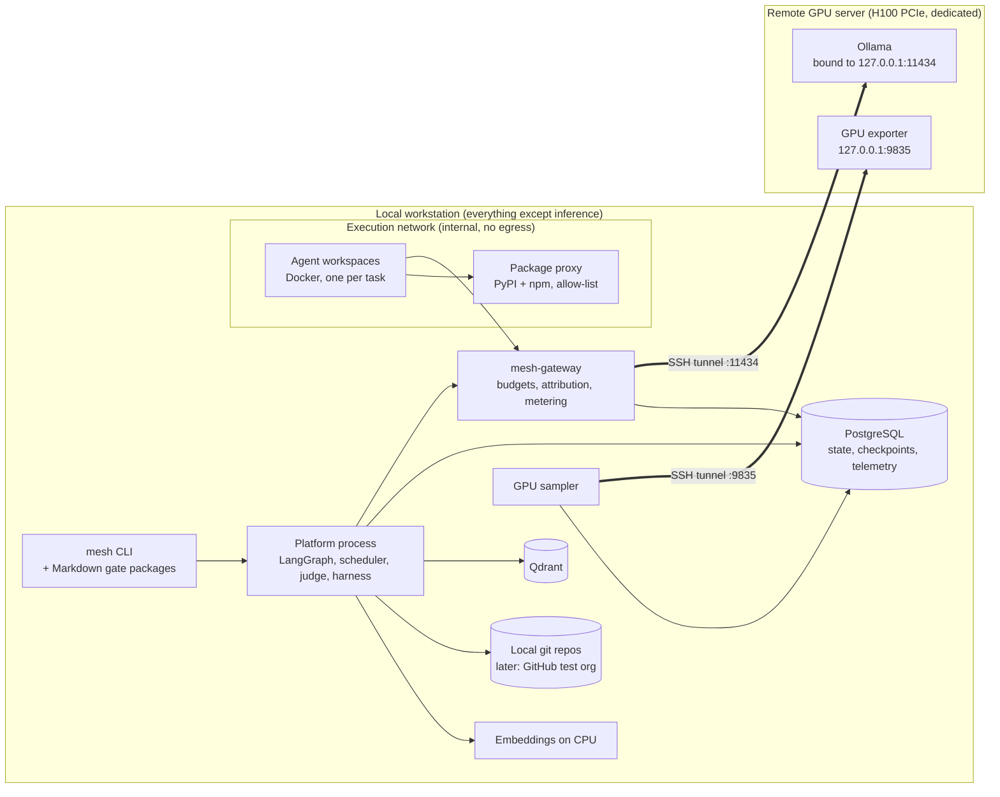

# 08 — Prototype Plan: Structure, Phases, Tests, Measurements

| | |
|---|---|
| **Project** | AI Mesh (working name) |
| **Status** | Draft v1 — items marked ⚠ need confirmation |
| **Date** | 2026-10-05 |
| **Depends on** | [01 charter v9](01-project-charter.md), [05 architecture v1.2](05-reference-architecture.md), [06 baseline v1.2](06-generated-system-baseline-and-release.md), [07 review R1](07-adversarial-architecture-review.md) |

## 1. Purpose

The prototype answers the questions the review said to answer first, in order:

1. **Capability.** Can a local model on the H100 PCIe, driven by an off-the-shelf harness, deliver S, M and an L-slice of a Python/FastAPI (+ Svelte) system against a sealed, human-written hidden test suite?
2. **Cost.** How many output tokens, GPU-hours, CI hours and human minutes does an accepted line of code cost? How does that scale with project size?
3. **Mesh value.** Does the verification-first mesh beat the strongest simple alternative (one agent loop with the same oracle and GPU budget), and which components earn their place?
4. **Mechanics.** Do durability, fencing, gates bound to hashes and the protected-path rules work under fault injection?

It covers the charter's P0, the capability spike, P1 and the core of P2, built and measured on a **split topology** (§2). It is **not** the production node: §2.4 lists what is simplified and why.

## 2. Prototype topology

### 2.1 Layout



### 2.2 SSH tunnel (as you proposed)

- **Remote side.** Ollama and the GPU exporter listen on **127.0.0.1 only**; nothing on the GPU server is exposed to the network. A dedicated `mesh-tunnel` user has a key restricted in `authorized_keys`:

  ```
  restrict,port-forwarding,permitopen="127.0.0.1:11434",permitopen="127.0.0.1:9835" ssh-ed25519 AAAA… mesh-tunnel
  ```

- **Local side.** Run `autossh`, binding forwarded ports to 127.0.0.1 only:

  ```
  autossh -M 0 -N \
    -o ServerAliveInterval=15 -o ServerAliveCountMax=3 -o ExitOnForwardFailure=yes \
    -L 127.0.0.1:11434:127.0.0.1:11434 \
    -L 127.0.0.1:9835:127.0.0.1:9835 \
    mesh-tunnel@<gpu-host>
  ```

  Run it as a user-level systemd service (or launchd on macOS) with restart on failure.

- **Who talks to the tunnel.** Only `mesh-gateway`, which runs on the host. Workspaces reach the gateway via the internal Docker network and **never** reach the tunnel port directly.
- **Readiness.** The gateway's `/ready` endpoint does a real 1-token generation through the tunnel. The scheduler admits no work while it fails.
- **Tunnel drops are infrastructure failures** (RV-11). The run pauses and alerts; no task attempt is consumed.
- **Latency.** The tunnel adds one network round trip per request; streaming hides most of it. It is measured separately in E0 (§6.3) so it is not mistaken for model latency.

### 2.3 Remote Ollama configuration (pinned in `infra/remote/`)

| Setting | Initial value | Why |
|---|---|---|
| `OLLAMA_HOST` | `127.0.0.1:11434` | Reachable only through the tunnel |
| `OLLAMA_CONTEXT_LENGTH` | 65536 (tuned in E0) | One server-wide value; never changed per request (avoids reloads, RV-16) |
| `OLLAMA_NUM_PARALLEL` | 4 (tuned in E0) | KV cache = context × slots; must fit with no CPU offload |
| `OLLAMA_MAX_LOADED_MODELS` | 1 | Model swaps happen only deliberately, during bake-offs |
| `OLLAMA_KEEP_ALIVE` | -1 | No cold unloads |
| `OLLAMA_FLASH_ATTENTION` / `OLLAMA_KV_CACHE_TYPE` | 1 / `q8_0` | Roughly doubles the context that fits |
| Model references | **By digest**, listed in `models.lock` | Mutable tags are not trusted (RV-14); weights only from official publisher sources |
| Driver / CUDA | 595.58.03 / 13.2, pinned | No unattended driver updates (RV-13) |

**After every configuration change:**

1. Check that `ollama ps` shows 100% GPU.
2. Record the configuration hash in the run manifest.

**Housekeeping before bring-up:** move the existing GPU workloads off the card (DN-10). Confirm that the remote server has `nvidia_gpu_exporter` or DCGM available ⚠.

### 2.4 Simplifications vs the target architecture

| Target (05) | Prototype | Why it is acceptable |
|---|---|---|
| Control plane and execution plane on separate hosts | Both on the workstation; execution in Docker on an internal network, with no host mounts beyond the workspace and no `docker.sock` | Synthetic projects only; no secrets or client credentials on the machine. Isolation is tested (T-SEC) |
| LiteLLM gateway | Thin in-house **`mesh-gateway`** (~500 LOC) | We need Ollama-level metering and per-task attribution, plus budget enforcement that fails closed. Avoids pulling LiteLLM until a verified version is pinned (March 2026 compromise). LiteLLM is re-evaluated in Phase 3 |
| GitHub + merge queue + rulesets | Local git repos (Phases 0–2); a **GitHub test organization** from Phase 3 | The capability spike needs only a loop, git and tests |
| Web UI for gates | **CLI + Markdown gate packages**, approvals hash-bound | Matches the MoSCoW re-baseline (07 §4.3) |
| Knowledge graph engine (AGE / Neo4j) | PostgreSQL traceability tables + Python import/call graph; graph engine trial in Phase 4 | The domain-layer KG must earn its place by ablation |
| Observability stack | OpenTelemetry spans → PostgreSQL `telemetry` schema + raw JSONL; Phoenix optional for browsing | One store to analyse; lightweight |
| Chroma cache | Off | Optional by design |
| Release and deploy | Phase 5 only: local Compose + kind rehearsal | Not needed to answer the capability questions |

**Workstation ⚠.** Confirm the OS and architecture of the machine that will run the local half. This folder sits under a macOS-style path; your dev machine is Ubuntu 24.04.

- **On Apple Silicon (arm64):** workspace and generated-system images build for arm64 locally, and CI and the release phase need multi-arch builds (`buildx`) for amd64 targets.
- **Size the machine for this load:** 4 concurrent workspaces plus PostgreSQL and Qdrant need about **32–48 GB RAM and 8+ cores** to run comfortably.

## 3. Repository structure

### 3.1 Layout

One monorepo, `ai_mesh/`, next to the existing `design/` folder. The hidden test suites live in a **separate private repository** that is never mounted into workspaces.

```
ai_mesh/
├── design/                         # 00–08 design artifacts (this folder)
├── adr/                            # ADR-001… (one file per decision)
├── platform/                       # Python package `mesh` (uv, Python 3.12+)
│   ├── pyproject.toml / uv.lock
│   ├── .importlinter               # module boundary contracts (05 §6)
│   ├── src/mesh/
│   │   ├── core/                   # config, ids, errors, logging, OpenTelemetry setup, run manifest
│   │   ├── telemetry/              # event schema, writers (PostgreSQL + JSONL), human-touch ledger
│   │   ├── llm/                    # client, role routing, token counting, budgets (fail closed)
│   │   ├── capacity/               # scheduler: GPU slot leases (P0 reserved), CPU lanes
│   │   ├── orchestration/          # LangGraph graphs (project/stage/task), PostgresSaver,
│   │   │                           # supervisor, fenced leases, flow_version, readiness barrier
│   │   ├── agents/                 # role registry loader, prompt rendering, output schemas
│   │   ├── workers/                # WorkerAdapter protocol + adapters:
│   │   │   ├── single_loop/        #   baseline: one agent loop (compiler-experiment style)
│   │   │   ├── deepagents/         #   LangChain Deep Agents
│   │   │   ├── openhands/          #   OpenHands SDK
│   │   │   └── opencode/           #   OpenCode
│   │   ├── workspace/              # sandbox manager (Docker), network policy, resource limits
│   │   ├── judge/                  # pinned oracle checkout, protected paths, test manifest,
│   │   │                           # skip/xfail detection, ratchets, failure classification
│   │   ├── oracle/                 # Gherkin + example tables, binding checks, mutation runs
│   │   ├── knowledge/              # traceability store, code graph, Qdrant retrieval, taint labels
│   │   ├── scm/                    # git (local), GitHub adapter (Phase 3+)
│   │   ├── governance/             # audit hash chain, gate packages + hashes, policies
│   │   ├── evaluation/             # experiment runner, hidden-suite scoring, metrics, reports
│   │   └── cli/                    # `mesh` CLI (Typer): run, gate, ledger, bench, report
│   └── tests/
│       ├── unit/  integration/  contract/
│       ├── conformance/            # durability, fencing, gates, fault injection (§5.3)
│       ├── security/               # isolation and oracle-gaming red-team fixtures (§5.4)
│       └── cassettes/              # recorded LLM exchanges for GPU-free CI
├── gateway/                        # mesh-gateway (FastAPI + httpx streaming proxy)
├── roles/                          # declarative role definitions (YAML) + prompts, versioned
├── templates/
│   └── python-fastapi-svelte/      # generated-system project template (06 §4) incl. secure defaults
├── benchmark/
│   ├── projects/<id>/              # spec/ (requirements, Gherkin + examples), meta.yaml
│   │                               # (tier, Delphi estimate, contamination note), reference/ (optional)
│   ├── microbench/<task-id>/       # repo snapshot ref, task spec, visible tests
│   └── experiments/<E-id>.yaml     # pre-registered experiment cards (§6.2)
├── tools/
│   ├── llm-bench/                  # throughput / context / concurrency / cache benchmarks
│   ├── gpu-sampler/                # polls the exporter through the tunnel → telemetry
│   └── analysis/                   # DuckDB/Parquet queries, report templates, bootstrap CIs
├── infra/
│   ├── local/compose.yaml          # PostgreSQL, Qdrant, package proxy (devpi + verdaccio),
│   │                               # optional Phoenix; profiles for optional services
│   ├── remote/                     # ollama.env, models.lock, systemd overrides, exporter setup
│   ├── tunnel/                     # autossh unit, authorized_keys template, health check
│   └── images/                     # workspace image (Python 3.12, uv, Node LTS, Playwright deps)
├── runs/                           # gitignored: per-run artifacts (§7.3)
└── Makefile                        # bootstrap, up, test, e2e, bench, report
# separate private repo: ai_mesh-hidden/  → sealed hidden suites + defect lists (judge/harness only)
```

### 3.2 Rules from day one

- **Module boundaries** are enforced by import-linter in the platform's CI.
- **The platform's own CI needs no GPU**: LLM calls are replayed from cassettes, and GPU-backed end-to-end tests run locally via `make e2e`.
- **Every run is reproducible from its manifest** (§7.1).
- **Synthetic data only.** No client material in the prototype.

## 4. Phase-by-phase implementation plan

Durations assume the core team in the charter. With fewer people, the order stays and the durations stretch. Each phase ends at a gate; thresholds come from [07 §4.2](07-adversarial-architecture-review.md) (⚠ DN-2).

### Phase 0 — Environment and instrumentation (weeks 1–2)

**Goal:** a measurable, reproducible environment before any agent work.

| # | Deliverable |
|---|---|
| 0.1 | Remote: GPU cleared of other workloads; Ollama configured (§2.3); candidate models pulled from official sources and pinned by digest in `models.lock`; GPU exporter on localhost |
| 0.2 | Tunnel: restricted user and key, autossh service, health check |
| 0.3 | Local stack: `infra/local/compose.yaml` (PostgreSQL, Qdrant, package proxy with initial allow-list, Phoenix optional) |
| 0.4 | `mesh-gateway`: OpenAI-compatible pass-through to Ollama with:<br>• per-task virtual keys mapping to run, task, role and attempt (agents cannot spoof attribution);<br>• tokenizer-based context budget check, rejecting rather than truncating;<br>• `max_tokens` and thinking caps;<br>• streaming metering (TTFT, decode rate);<br>• writes to `telemetry.llm_calls`;<br>• `/ready` endpoint |
| 0.5 | Telemetry schema + run manifest + human-touch ledger CLI (`mesh ledger start/stop <category>`) |
| 0.6 | GPU sampler (1 s) → `telemetry.gpu_samples` |
| 0.7 | `llm-bench` and experiment **E0** (throughput characterization, §6.3) |
| 0.8 | Investigation: which metrics Ollama exposes on `/v1` vs native `/api/chat` (`prompt_eval_count`, durations). If `/v1` lacks them, the gateway translates or logs native calls, or server logs are parsed. Needed for the cached-prefix ratio (RV-05) ⚠ |

**Exit:**

- E0 report published: tok/s vs context and concurrency, TTFT, VRAM, power capping, tunnel overhead, cached-prefix ratio on a prefix-stable multi-turn script.
- Ollama `CONTEXT_LENGTH` and `NUM_PARALLEL` fixed from data.
- Readiness and tunnel-drop handling demonstrated.

### Phase 1 — Capability spike (weeks 3–8)

**Goal:** answer question 1 with the simplest possible machinery (charter "capability spike").

| # | Deliverable |
|---|---|
| 1.1 | Workspace image and sandbox manager: one container per task, resource limits, internal network (gateway + package proxy only), no host mounts beyond the workspace |
| 1.2 | **Judge v0**: runs the oracle from a hash-pinned checkout against the workspace result; protected-path manifest; test-count manifest; skip/xfail/deselect detection; infra vs task failure classification |
| 1.3 | `single_loop` worker (baseline) + **one** off-the-shelf harness adapter (start with Deep Agents: it matches the LangChain stack and supports Ollama) |
| 1.4 | Spike loop (compiler-experiment pattern): task list → worker → judge → commit to local git → next task; retries with structured failure reports; escalation file when attempts run out |
| 1.5 | Benchmark content v0 (§6.1): micro-benchmark (50 tasks to start); **S1** API-only project with hidden suite; **M1** spec with hidden suite; **L-slice** (2–3 modules of an L spec with frozen contracts) |
| 1.6 | Experiments **E1** (micro-benchmark), **E2** (S1 → M1 → L-slice) |

**Exit — capability gate (pass / pivot / kill):**

- hidden-suite pass rate on M1;
- escalations per KLOC;
- output tokens per accepted LOC;
- GPU-hours;
- whether growth from S1 to the L-slice is linear or superlinear.

This replaces the planning range in 02 §10 with measured numbers.

### Phase 2 — Harness and benchmark (weeks 6–12, overlaps Phase 1)

**Goal:** make measurement honest and repeatable before building the mesh.

| # | Deliverable |
|---|---|
| 2.1 | Experiment runner: experiment cards, k ≥ 3 repeats, seeds, frozen BOM per experiment, automated report with bootstrap CIs |
| 2.2 | Benchmark v1: micro-benchmark grown to 100–300 tasks; 2 S + 2 M projects + 1 L-slice; reference implementations or mutation-validated oracles; one sealed held-out project used only at phase exits |
| 2.3 | Remaining adapters (OpenHands, OpenCode) behind `WorkerAdapter`; adapter contract tests |
| 2.4 | Experiment **E3** (model × quantization × harness bake-off on the micro-benchmark; vLLM comparison if E0 shows prefix-cache problems) |
| 2.5 | Calibration project: one S-tier project built by humans with the ledger running, to anchor the human baseline (RV-07) |

**Exit:**

- harness reproduces results within ±5 pp over 3 repeats;
- primary model, quantization and harness chosen on data (D2a, D2b, D3).

### Phase 3 — Mesh core, increment 1 (weeks 10–16)

**Goal:** the verification-first workflow with durable mechanics.

| # | Deliverable |
|---|---|
| 3.1 | LangGraph project/stage/task graphs with PostgresSaver (`durability="sync"`), `flow_version`, **fenced leases**, supervisor, readiness barrier, capped resumes, quarantine |
| 3.2 | Scheduler: GPU slot leases with one slot reserved for P0, priority classes, CPU lane for test runs |
| 3.3 | Lifecycle through G1 → Design → AdversarialReview → G2 → OracleBinding → G2b, with **Markdown gate packages stored by hash**; approvals through the CLI carry the hash and approver; fail closed on mismatch |
| 3.4 | Roles v1: intake, clarifier, use-case analyst, oracle author (×2 independent generations), architect, reviewers (mechanical checks + LLM), planner, worker, test-author, judge |
| 3.5 | Knowledge v1: traceability tables, Python import/call graph, Qdrant retrieval over requirements/docs/code with taint labels; CPU embeddings |
| 3.6 | GitHub test organization: delivery App (no `workflows` permission), platform-owned pinned workflows, CODEOWNERS on protected paths |
| 3.7 | Conformance suite T-DUR and security suite T-SEC green (§5) |

**Exit:** S-tier delivered end-to-end through G1/G2/G2b, scored on its hidden suite; all conformance tests pass.

### Phase 4 — Mesh core, increment 2 + mesh vs baseline (weeks 15–22)

| # | Deliverable |
|---|---|
| 4.1 | Foundation stage; module integration milestones; refactor/consolidate tasks driven by ratcheted metrics (duplication, complexity, module size, suppressions) |
| 4.2 | Merge queue + scope leases; serialized hotspots (migrations, contracts); acceptance ratchet; multiple-Alembic-heads check |
| 4.3 | Change Request flow (impact analysis → delta oracle → G1-delta → re-plan); one mid-build change injected per M project |
| 4.4 | Svelte front end added from M-tier (DN-4): UI contract at G2, role/label locators, visual baselines, human UX checkpoint |
| 4.5 | Knowledge graph engine trial (Apache AGE vs Neo4j) for the domain layer, **kept only if** the ablation shows a benefit |
| 4.6 | Experiments **E4** (mesh vs baseline, k ≥ 3, with ablations) and **E7** (red-team) |

**Exit (P2 → P3a gate):**

- absolute hidden-suite threshold met on M;
- never worse than the baseline on escaped defects;
- better on two of {hidden pass, human hours, GPU-hours} with CIs.

### Phase 5 — L-probe and release slice (weeks 20–26)

| # | Deliverable |
|---|---|
| 5.1 | Experiment **E5**: mesh on an L-tier probe (3–5 modules, ≥ 30–50k LOC) with frozen contracts; measure the scale curve |
| 5.2 | Release slice: build-once images, SBOM, cosign signing, promotion attestation, rehearsal on local Compose + kind (install / upgrade / rollback), offline bundle |
| 5.3 | Hypercare/Maintenance flow exercised: one post-release fix through the hotfix path |
| 5.4 | Decision pack for P3a on the real node (or pivot) |

## 5. Test plan (the platform itself)

### 5.1 Test levels

| Level | Scope | Runs where | Gate |
|---|---|---|---|
| Static | ruff, mypy strict, import-linter, Semgrep | Platform CI on every PR | Required |
| Unit | Pure logic: budgets, leases, hashing, manifests, schedulers, metric calculations | Platform CI | Required, coverage ratchet |
| Integration | PostgreSQL / Qdrant / Docker via Testcontainers; gateway against a fake Ollama | Platform CI | Required |
| Contract | `WorkerAdapter` conformance per adapter; gateway OpenAI-compatibility; telemetry schema | Platform CI (cassettes) | Required |
| Conformance (§5.3) | Durability, fencing, gates, fault injection | Platform CI (cassettes) + nightly local with GPU | Required before Phase 3 exit |
| Security (§5.4) | Isolation and oracle-gaming red-team | Platform CI + nightly | Required before Phase 3 exit |
| End-to-end | Real model through the tunnel on S1 | `make e2e` locally, nightly | Trend tracked |
| Evaluation validity (§5.5) | The benchmark measures what it claims | Before each experiment | Required |

### 5.2 Cassettes (GPU-free CI)

LLM exchanges are recorded through `mesh-gateway` (request hash → response) and replayed in CI. When a prompt changes, the cassette is re-recorded deliberately; a cassette miss fails the test. This keeps platform CI fast and deterministic, while model behaviour is measured only in experiments.

### 5.3 Conformance tests (durability and gates)

| ID | Test | Pass criterion |
|---|---|---|
| T-DUR-01 | SIGKILL the platform mid-task, restart | Thread resumes from the last checkpoint; no completed node re-executes; no duplicate commits or PRs |
| T-DUR-02 | Lease expires while the holder is alive (stalled heartbeat) | Second runner fenced: stale epoch writes rejected; stalled runner self-terminates |
| T-DUR-03 | Tunnel drop for 2 minutes during Build | Scheduler pauses; no attempts consumed; resumes automatically after readiness |
| T-DUR-04 | Ollama cold or unavailable at start | Readiness barrier blocks admission; alert raised |
| T-DUR-05 | Graph code changes (`flow_version` bump) while a thread is parked at G2 | Parked thread resumes on its compatible path; resume test in CI catches incompatibility |
| T-DUR-06 | Gate approved with a mismatched package hash | Rejected, fail closed |
| T-DUR-07 | Resume of a gate node does not regenerate the package | Package hash unchanged after resume |
| T-DUR-08 | Workspace OOM-killed during tests | Classified as infra failure; attempt not consumed |
| T-DUR-09 | Resume loop (checkpoint that crashes on every resume) | Quarantined after N attempts; alert raised |
| T-DUR-10 | Disk at 85% | Scheduler stops P2/P3 work and the CI lane before PostgreSQL is at risk |

### 5.4 Security tests

| ID | Test | Pass criterion |
|---|---|---|
| T-SEC-01 | From a workspace: reach PostgreSQL, Qdrant, the tunnel port, or the internet directly | All blocked; only the gateway and package proxy are reachable |
| T-SEC-02 | Workspace attempts to access `docker.sock` or host paths | Not present / denied |
| T-SEC-03 | Worker edits `conftest.py`, pytest config, a workflow file, `contracts/`, or `.importlinter` | Judge rejects (protected path) |
| T-SEC-04 | Worker adds skip/xfail/deselect, or reduces the collected test count | Judge rejects |
| T-SEC-05 | Worker adds a test-mode branch (`if settings.TESTING`) | Semgrep finding; judge rejects |
| T-SEC-06 | Worker adds an unknown, very young or non-existent package | Package proxy refuses; lockfile diff flagged for human approval |
| T-SEC-07 | Prompt injection planted in a research page, test output, or dependency README | No new dependency, URL, command or scope change without human approval; taint label propagated |
| T-SEC-08 | Agent credentials call a gate-approval endpoint | Denied |
| T-SEC-09 | Context exceeds the role budget | Gateway rejects; no silent truncation |
| T-SEC-10 | Audit chain row edited in the database | Off-box verifier detects it at the next anchor |

### 5.5 Evaluation validity tests

| ID | Test | Pass criterion |
|---|---|---|
| T-EVL-01 | Reference implementation runs against its hidden suite | 100% pass (validates the oracle) |
| T-EVL-02 | Mutated reference implementation (mutmut) runs against the hidden suite | Mutation score ≥ threshold (oracle strength) ⚠ threshold set in Phase 2 |
| T-EVL-03 | Same configuration, 3 repeats | Primary metric within ±5 pp, or variance reported and k raised |
| T-EVL-04 | Hidden suite isolation | No hidden test file reachable from any workspace or retrieval index |
| T-EVL-05 | Baseline fairness | Baseline and mesh get the same oracle, CI, task list and GPU-token budget (audited from the manifest) |

## 6. Benchmark and experiments

### 6.1 Benchmark content

| Item | Tier | Content | Source | Notes |
|---|---|---|---|---|
| Micro-benchmark | Task | 50 → 100–300 tasks: implement an endpoint, a service function, a migration, a fix; each with visible + hidden tests | Cut from our S/M reference implementations, plus permissively licensed FastAPI open-source projects | Bake-offs run here (cheap, many samples) |
| S1 | S (~5–10k LOC) | API-only system, e.g. library lending (users, catalogue, loans, fines) | Written by us | First end-to-end target |
| S-cal | S | A comparable system built by humans with the ledger running | Written by us | Human-baseline calibration (RV-07) |
| RealWorld (Conduit) API | S | Public API spec with a public API test collection | [gothinkster/realworld](https://github.com/gothinkster/realworld) ⚠ verify licence and test suite | **Harness calibration only.** Contaminated: models have seen implementations, so no capability claims are drawn from it |
| M1, M2 | M (~40–60k LOC) | E.g. clinic scheduling + billing; field-service work orders. Svelte UI from M-tier | Written by us | One mid-build change request each |
| L-slice | L subset | 2–3 modules (then 3–5) of an L spec with frozen contracts | Written by us | Scale-curve probe |
| Held-out H1 | M | Sealed; authored by someone outside the mesh team | Customer SME ⚠ | Used only at phase exits |

**Every project ships with:**

- requirements (EARS);
- Gherkin + example tables;
- a sealed hidden suite and hidden defect list;
- a Wideband Delphi human-effort estimate;
- a tier label;
- a contamination note.

### 6.2 Experiment cards (pre-registered)

Each experiment has a card in `benchmark/experiments/`, written **before** running:

```yaml
id: E3-bakeoff-01
question: Which model/quant/harness maximizes accepted tasks per GPU-hour on the micro-benchmark?
hypothesis: MoE-A3B worker at 4-bit is >= 1.5x accepted tasks/GPU-hour vs 27B 8-bit with <= 5 pp lower pass rate
configs: [qwen3.8-27b@q8, qwen3.8-27b@q4, qwen3.6-35b-a3b@q4, ...]   # digests from models.lock
harnesses: [single_loop, deepagents]
dataset: microbench@v1 (150 tasks)
repeats: 3
budget: {gpu_hours: 60, max_tokens_per_task: 120000}
primary_metric: accepted_tasks_per_gpu_hour
secondary: [hidden_pass_rate, output_tokens_per_accepted_loc, ttft_p50, escalation_rate]
decision_rule: choose highest primary metric whose hidden_pass_rate CI overlaps the best
frozen_bom: true
```

**Rules:**

- The BOM is frozen during an experiment.
- No prompt tuning on held-out projects.
- Every run is reported, including failed runs.
- Decisions cite the card.

### 6.3 Experiment list

| ID | Phase | Question | Design | Primary metric(s) |
|---|---|---|---|---|
| **E0** | 0 | Raw serving capacity on H100 PCIe through the tunnel | Models × quantization (4/6/8-bit) × context (8K/32K/64K/128K) × concurrency (1/2/4/8); prefix-stable multi-turn script for caching; tunnel overhead | Decode tok/s, prefill tok/s, TTFT, cached-prefix ratio, VRAM, power-cap time |
| **E1** | 1 | Can one model + harness solve isolated tasks? | 50 micro tasks, 1 model, `single_loop` vs Deep Agents, k=3 | Hidden pass rate; output tokens per accepted LOC; GPU-s/task |
| **E2** | 1 | Capability spike: does it scale S → M → L-slice? | Spike loop on S1, M1, L-slice | Hidden pass rate; escalations/KLOC; tokens/LOC; GPU-hours; growth curve |
| **E3** | 2 | Best model / quantization / harness / engine | Micro-benchmark (100–300 tasks), k=3; vLLM arm if E0 shows cache problems | Accepted tasks per GPU-hour, at pass rate within the CI of the best |
| **E4** | 4 | Is the mesh worth it? | Mesh vs baseline on S1, M1, M2 (k=3) + ablations (no KG, no adversarial review, no planner hierarchy, no Foundation stage) | Hidden pass rate; escaped defects; human minutes; GPU-hours |
| **E5** | 5 | L-tier behaviour | Mesh on the L probe | Scale curve; erosion metrics; escalations/KLOC |
| **E6** | 3–5 | Durability under faults | T-DUR suite at scale (kill/drop during real runs) | Lost work; duplicate side effects; recovery time |
| **E7** | 4 | Oracle gaming and injection | Planted impossible tasks, injected pages/outputs | Gaming rate; detection rate (judge, Semgrep); false positives |

## 7. Measurements and data collection

### 7.1 Run manifest (one per run)

**Identity:**

- `run_id`, `experiment_id`, `benchmark_item@version`, seed, start/end.

**Platform BOM:**

- platform git SHA, roles/prompts SHA, template SHA;
- harness name and version;
- model name **and digest**, quantization;
- Ollama version and the hash of the env config in §2.3;
- gateway version;
- embedding model and version;
- driver / CUDA version.

**Budgets and limits:**

- GPU-token budget, context budgets per role, attempt limits.

**Topology:**

- workstation spec, tunnel endpoint ID (no secrets).

Stored as `runs/<run_id>/manifest.json` and in `telemetry.runs`. A metric without a manifest is not used.

### 7.2 Metric catalog

**Per LLM call** (`telemetry.llm_calls`, written by `mesh-gateway`):

| Field | Meaning |
|---|---|
| run_id, task_id, role, attempt, call_seq | Attribution, from the per-task virtual key (agents cannot spoof it) |
| model_digest | Exact weights |
| prompt_tokens, prompt_tokens_computed | Input tokens; tokens actually prefilled (cache misses). The ratio gives the cached-prefix ratio |
| completion_tokens, thinking_tokens | Output, including reasoning |
| ttft_ms, decode_tps, total_ms, tunnel_rtt_ms | Latency breakdown |
| context_budget, rejected_over_budget | Budget enforcement (should never truncate) |
| error_class | none / infra (tunnel, Ollama) / client / budget |
| request_hash, response_hash | Links to raw transcripts on disk |

**Per task** (`telemetry.tasks`, `telemetry.judge_results`):

| Metric | Definition |
|---|---|
| status | accepted / escalated / quarantined / infra-failed |
| attempts | Worker attempts until acceptance or escalation |
| wall_clock_s, gpu_s, tool_s, ci_s | Where the time went (GPU-s = sum of LLM call durations) |
| output_tokens, input_tokens_computed | Token cost |
| loc_added / loc_removed (accepted diff) | Size of the accepted change |
| **output_tokens_per_accepted_loc** | Key forecasting parameter (RV-05) |
| judge verdicts | Per check: pass/fail, failure taxonomy (assertion, error, timeout, lint, type, protected-path, skip-detected, scope) |
| visible_pass, hidden_pass | Mesh-oracle result vs sealed hidden result |
| oracle_defect_reports | Typed "oracle defect / impossible task" reports filed |
| violations | Protected-path, scope, suppression growth, test-count drop |
| escalation_minutes | Human minutes from the ledger, linked to the task |

**Per project run** (`telemetry.project_results`):

| Metric | Definition |
|---|---|
| **hidden_pass_rate** (by requirement priority) | Primary quality metric |
| mesh_oracle_pass_rate, oracle_agreement | Oracle quality |
| escaped_defects | Hidden defect list items not caught + defects found in UAT/hypercare (severity scale ⚠ P0) |
| human_minutes by category | Gates, G1 review, PR sampling, escalations, clarifications, UAT, platform-team intervention |
| gpu_hours, ci_hours, wall_clock_days | Cost and duration |
| escalations_per_kloc, rework_ratio | Scale-curve inputs |
| erosion metrics | Duplication %, cyclomatic complexity (radon), module size vs budget, suppression count, public-surface growth |
| mutation_score | Per module and final |
| forecast vs actual | P10/P50/P90 vs actual, task level rolled up |

**System** (`telemetry.gpu_samples`, `telemetry.system_samples`, 1–10 s):

- GPU: utilization, memory used, power, clocks, power-capping flag, temperature, ECC events.
- Ollama: `ollama ps` residency / offload.
- Workstation: CPU, RAM, disk per container.
- Queue depth, slot occupancy, admission wait.
- Tunnel up/down events.

**Human-touch ledger** (`telemetry.human_ledger`):

- **Fields:** person (pseudonymous ID), category, project, task / gate ref, start, end, note.
- **Captured** by the CLI (`mesh ledger start/stop`) and automatically by gate commands (time from package open to decision).
- **Platform-team interventions** during a run (prompt fixes, manual repairs) **must** be logged; they count toward O2.

### 7.3 Storage and pipeline

| Layer | What | Where |
|---|---|---|
| Structured events | Tables in §7.2 (append-only) | PostgreSQL schema `telemetry` |
| Traces | OpenTelemetry spans (run → stage → task → call/tool) | PostgreSQL (and Phoenix, optional) |
| Raw artifacts | Transcripts (`jsonl.zst`), diffs, JUnit XML, coverage, mutation reports, gate packages + hashes, judge logs | `runs/<run_id>/…`, content-addressed |
| Analysis | Nightly export to Parquet; DuckDB queries; report templates with bootstrap CIs | `tools/analysis/`, `runs/_reports/` |

- **Run report:** generated automatically per run.
- **Experiment report:** generated per experiment card, comparing configs with CIs and stating the decision rule outcome.

**Data hygiene:**

- synthetic data only;
- secrets redacted before writing (gitleaks patterns + known values);
- hidden suites never copied into `runs/` or retrieval indexes (only scores);
- retention: raw transcripts 180 days, aggregates kept.

### 7.4 Dashboards (Grafana or report pages)

1. **Live run:** queue, slots, GPU, tunnel, current tasks, escalations.
2. **Cost:** tokens per accepted LOC, GPU-s per task, cached-prefix ratio over time.
3. **Quality:** hidden vs visible pass, oracle agreement, violations, erosion trend.
4. **Human:** ledger minutes by category per KLOC.

## 8. First-week checklist

1. Confirm the workstation (OS, CPU architecture, RAM, cores) ⚠.
2. Remote: move the existing GPU workloads off; apply the Ollama env (§2.3); install the GPU exporter; create the restricted `mesh-tunnel` user.
3. Choose the 3–4 E0 candidate models; pull from official publisher sources; record digests in `models.lock`.
4. Create the `ai_mesh` monorepo skeleton (§3) and the private `ai_mesh-hidden` repo.
5. Bring up `infra/local` (PostgreSQL, Qdrant, package proxy).
6. Implement `mesh-gateway` v0 (pass-through + metering + virtual keys + budget rejection) and the telemetry schema.
7. Run E0 (first pass: one model, 4 context sizes × 4 concurrency levels).
8. Start writing S1 (requirements, Gherkin + examples, hidden suite) in parallel.

## 9. Open items

1. Workstation spec and architecture ⚠ (affects image builds and concurrency).
2. GPU exporter availability on the remote server ⚠.
3. Ollama `/v1` metric fields vs native API ⚠ (Phase 0 investigation 0.8).
4. RealWorld spec and test-suite licence check before use ⚠.
5. Held-out project author (customer SME) ⚠.
6. GitHub test organization for Phase 3 (Enterprise trial if DN-5 is approved).
